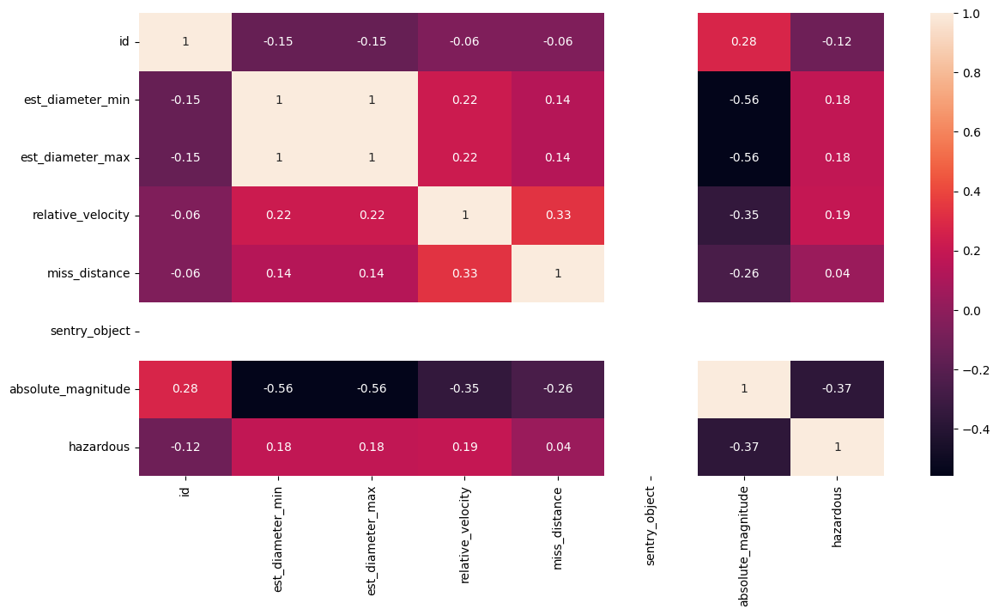
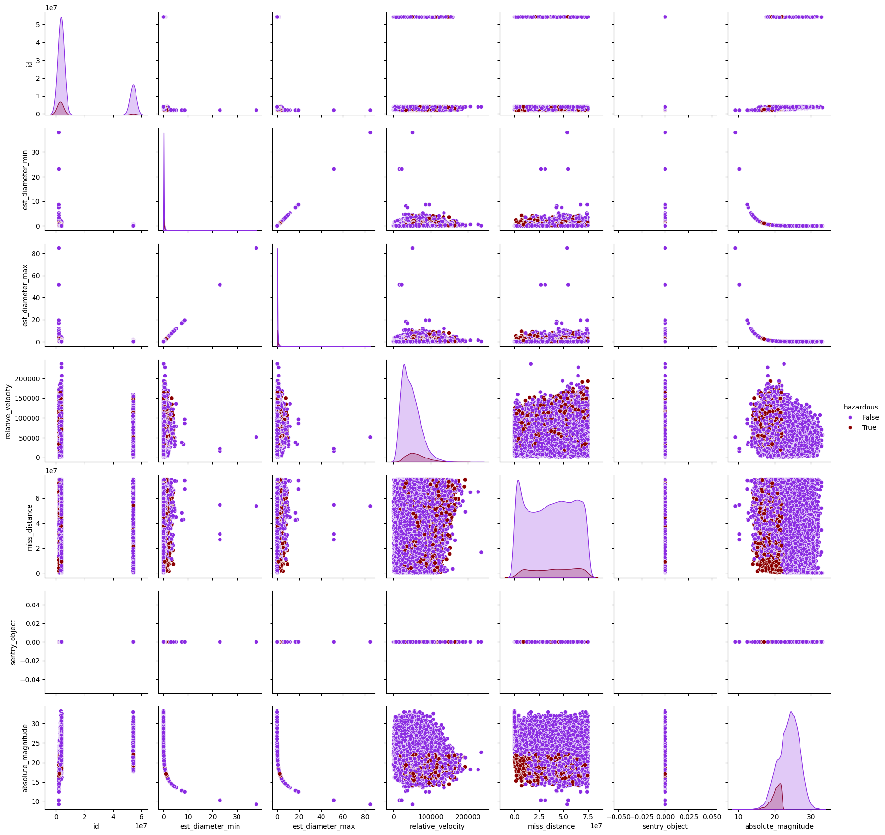
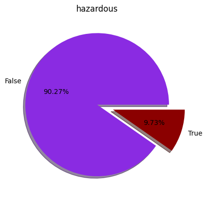
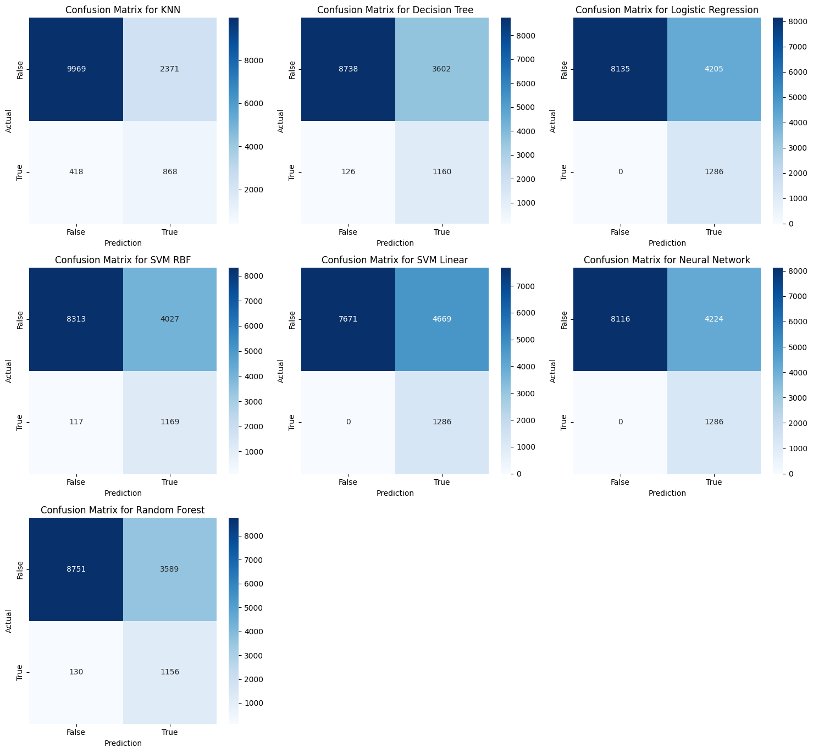

Hossein Atalu

# **Machine Learning Project Documentation**

---

## **1. Introduction**

This project analyzes NASA’s dataset of Near-Earth Objects (NEOs) to classify asteroids as hazardous or non-hazardous using machine learning techniques. The steps include preprocessing, exploratory data analysis (EDA), feature engineering, model training, and ensemble learning.

### **Key Objectives**:

1. Understand the dataset and preprocess it for machine learning models.
2. Apply various machine learning algorithms and evaluate their performance.
3. Optimize models using hyperparameter tuning.
4. Implement ensemble learning and meta-modeling for improved accuracy.

---

## **2. Dataset Overview**

The dataset includes information on asteroids, such as size, velocity, and proximity to Earth. The target variable is `hazardous`, which indicates whether an asteroid poses a potential threat.

```python
# Load dataset
data = pd.read_csv("/root/.cache/kagglehub/datasets/sameepvani/nasa-nearest-earth-objects/versions/2/neo.csv")
data.head()
```
| ID       | Name                 | Est. Diameter Min | Est. Diameter Max | Relative Velocity | Miss Distance   | Orbiting Body | Sentry Object | Absolute Magnitude | Hazardous |
|----------|----------------------|-------------------|-------------------|-------------------|-----------------|---------------|---------------|---------------------|-----------|
| 2162635  | 162635 (2000 SS164)  | 1.198271          | 2.679415          | 13569.249224      | 5.483974e+07    | Earth         | False         | 16.73              | False     |
| 2277475  | 277475 (2005 WK4)    | 0.265800          | 0.594347          | 73588.726663      | 6.143813e+07    | Earth         | False         | 20.00              | True      |
| 2512244  | 512244 (2015 YE18)   | 0.722030          | 1.614507          | 114258.692129     | 4.979872e+07    | Earth         | False         | 17.83              | False     |
| 3596030  | (2012 BV13)          | 0.096506          | 0.215794          | 24764.303138      | 2.543497e+07    | Earth         | False         | 22.20              | False     |
| 3667127  | (2014 GE35)          | 0.255009          | 0.570217          | 42737.733765      | 4.627557e+07    | Earth         | False         | 20.09              | True      |
| ...      | ...                  | ...               | ...               | ...               | ...             | ...           | ...           | ...                | ...       |
| 3763337  | (2016 VX1)           | 0.026580          | 0.059435          | 52078.886692      | 1.230039e+07    | Earth         | False         | 25.00              | False     |
| 3837603  | (2019 AD3)           | 0.016771          | 0.037501          | 46114.605073      | 5.432121e+07    | Earth         | False         | 26.00              | False     |
| 54017201 | (2020 JP3)           | 0.031956          | 0.071456          | 7566.807732       | 2.840077e+07    | Earth         | False         | 24.60              | False     |
| 54115824 | (2021 CN5)           | 0.007321          | 0.016370          | 69199.154484      | 6.869206e+07    | Earth         | False         | 27.80              | False     |
| 54205447 | (2021 TW7)           | 0.039862          | 0.089133          | 27024.455553      | 5.977213e+07    | Earth         | False         | 24.12              | False     |

90836 rows × 10 columns

### **Features**:

- **`est_diameter_min`**: Minimum estimated diameter (km).
- **`est_diameter_max`**: Maximum estimated diameter (km).
- **`relative_velocity`**: Velocity relative to Earth.
- **`miss_distance`**: Closest distance to Earth (km).
- **`absolute_magnitude`**: Luminosity of the asteroid.

### **Target**:

- **`hazardous`**: Boolean indicating whether an asteroid is hazardous.

---

## **3. Data Preprocessing**

### **3.1 Missing Values**

The dataset was checked for missing values:

```python
data.isna().sum()
```
| Column               | Missing Values |
|----------------------|----------------|
| id                  | 0              |
| name                | 0              |
| est_diameter_min    | 0              |
| est_diameter_max    | 0              |
| relative_velocity   | 0              |
| miss_distance       | 0              |
| orbiting_body       | 0              |
| sentry_object       | 0              |
| absolute_magnitude  | 0              |
| hazardous           | 0              |

dtype: int64

### **3.2 Heatmap**

A correlation heatmap was used to identify relationships between features:

```python
correlation = data.corr(method='pearson', numeric_only=True).round(2)
sns.heatmap(correlation, annot=True, cmap='rocket')
```

## Heatmap



### **3.3 Pairplot**

Relationships between features and the target were visualized using pairplots:

```python
sns.pairplot(data, hue='hazardous', palette=['#8A2BE2', '#8B0000'])
```
## Pairplot



### **3.4 Handling Outliers**

Outliers were detected using interquartile ranges (IQR) and removed:

```python
lowoutliers = data_analyses.absolute_magnitude.quantile(0.75) + ...
```

Handling Class Imbalance

    The dataset is imbalanced as the number of non-hazardous asteroids far outweighs hazardous ones.

Resampling Techniques:

    1.Oversampling with SMOTE

    2.Undersampling

    3.Combination of Oversampling and Undersampling (SMOTETomek)
```python
# SMOTE Example
smote = SMOTE(random_state=42)
X_resampled, y_resampled = smote.fit_resample(X, y)
```
Encoding Categorical Variables
```python
test_data['hazardous'] = pd.Categorical(test_data['hazardous']).codes
val_data['hazardous'] = pd.Categorical(val_data['hazardous']).codes

data_analyses['hazardous'] = pd.Categorical(data_analyses['hazardous']).codes
data_noise['hazardous'] = pd.Categorical(data_noise['hazardous']).codes
data_resample['hazardous'] = pd.Categorical(data_resample['hazardous']).codes
data_resample2['hazardous'] = pd.Categorical(data_resample2['hazardous']).codes
```

### **3.5 Train-Test Split**

The data was split into training, validation, and test sets:

```python
data_train, test_data = train_test_split(data, test_size=0.15, random_state=42)
data_analyses, val_data = train_test_split(data_train, test_size=0.17, random_state=42)
```

---

## **4. Exploratory Data Analysis (EDA)**

### **4.1 Feature Distribution**

Key features were visualized to understand their distribution:

```python
sns.histplot(data['relative_velocity'], kde=False, color='#66CDAA')
```

### **4.2 Hazardous Asteroids**

The target variable distribution:

```python
plt.pie(data['hazardous'].value_counts(), labels=['False', 'True'], autopct='%1.2f%%')
```
## pie

---

## **5. Feature Engineering**

### **5.1 Selected Features**

- `est_diameter_max`
- `relative_velocity`
- `miss_distance`
- `absolute_magnitude`

### **5.2 Feature Combinations**

Random Forest was used to evaluate feature combinations:

```python
for combo in combinations(features, r):
    rf.fit(x_subset_train, y_train)
    acc = rf.score(x_subset_test, y_test)
    print(f"Combination: {combo}, Accuracy: {acc:.4f}")
```

---

## **6. Machine Learning Models**

### **6.1 Models Implemented**

- **KNN**:
  ```python
  KNeighborsClassifier(n_neighbors=4, weights='uniform')
  ```
- **Decision Tree**:
  ```python
  DecisionTreeClassifier(max_depth=19, class_weight={0: 1, 1: 9})
  ```
- **Random Forest**:
  ```python
  RandomForestClassifier(n_estimators=100, class_weight='balanced')
  ```
- **Logistic Regression**, **SVM**, **MLP**

### **6.2 Evaluation Metrics**

- **Accuracy**
- **Precision**
- **Recall**
- **F1 Score**

```python
accuracy_score(y_test, y_pred)
f1_score(y_test, y_pred)
```

---

## **7. Hyperparameter Tuning**

GridSearchCV was used for hyperparameter optimization:

```python
param_grid = {
    'n_neighbors': [3, 5, 7],
    'weights': ['uniform', 'distance']
}
grid_search = GridSearchCV(knn, param_grid, cv=5, scoring='f1')
grid_search.fit(x_train, y_train)
```
## Results for Models (Data Noise Resample)

| Model                | Accuracy | Precision | Recall | F1 Score | Training Time (s) | Prediction Time (s) | Confusion Matrix | Fitted Model                                            |
|----------------------|----------|-----------|--------|----------|--------------------|---------------------|------------------|----------------------------------------------------------|
| **KNN**              | 0.795    | 0.268     | 0.675  | 0.384    | 0.040              | 0.659               | [[9969, 2371], [418, 868]] | KNeighborsClassifier(n_neighbors=1, p=1)             |
| **Decision Tree**    | 0.726    | 0.244     | 0.902  | 0.384    | 0.101              | 0.002               | [[8738, 3602], [126, 1160]] | DecisionTreeClassifier(max_depth=19)                 |
| **Logistic Regression** | 0.691    | 0.234     | 1.000  | 0.380    | 0.123              | 0.002               | [[8135, 4205], [0, 1286]]  | LogisticRegression(C=0.01, max_iter=10, solver...)   |
| **SVM (RBF)**        | 0.696    | 0.225     | 0.909  | 0.361    | 220.297            | 16.233              | [[8313, 4027], [117, 1169]] | SVC(gamma=2)                                           |
| **SVM (Linear)**     | 0.657    | 0.216     | 1.000  | 0.355    | 163.278            | 9.610               | [[7671, 4669], [0, 1286]]  | SVC(gamma=2, kernel='linear')                        |
| **Neural Network**   | 0.690    | 0.233     | 1.000  | 0.378    | 2.740              | 0.023               | [[8116, 4224], [0, 1286]]  | MLPClassifier(hidden_layer_sizes=(100, 50), max_iter=500) |
| **Random Forest**    | 0.727    | 0.244     | 0.899  | 0.383    | 0.731              | 0.011               | [[8751, 3589], [130, 1156]] | RandomForestClassifier(n_estimators=100)              |

---

## **8. Ensemble Learning**

### **8.1 Meta-Model**

Outputs from base models were stacked and passed into a neural network meta-model:

```python
meta_model = Sequential([
    Dense(16, activation='relu', input_shape=(meta_inputs_val.shape[1],)),
    Dense(8, activation='relu'),
    Dense(1, activation='sigmoid')
])
meta_model.compile(optimizer='adam', loss='binary_crossentropy', metrics=['accuracy'])
```

### **8.2 Meta-Model Results**

Accuracy and F1 Score:

```python
print(f'score : {accuracy_score(meta_test_preds.round(), y_test)}')
print(f'f1 : {f1_score(meta_test_preds.round(), y_test)}')
```

---

## **9. Visualization**

### **9.1 Confusion Matrices**

```python
sns.heatmap(cm, annot=True, fmt='d', cmap='Blues')
```
## Confusion Matrices



### **9.2 Decision Tree Visualization**

```python
tree.plot_tree(dt_model, filled=True)
```


---

## **10. Conclusion**

This project demonstrates the successful application of machine learning techniques to classify hazardous asteroids. Key findings include:

1. Random Forest and ensemble models provided the best performance.
2. Meta-modeling improved classification accuracy by combining outputs from base models.

### **Future Work**

- Use external datasets to enhance model robustness.
- Explore advanced deep learning techniques for improved performance.
